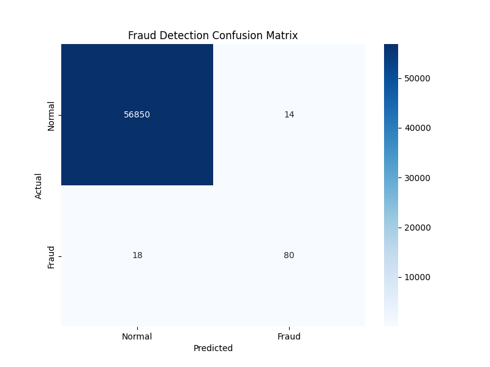

# 💳 Credit Card Fraud Detection System


## 📌 Business Scenario
In the financial sector, a false negative (failing to detect fraud) results in direct financial loss, while a false positive (blocking a legitimate user) leads to poor customer experience. 

This project solves the **Class Imbalance problem** (only 0.17% fraud data) to build a robust model that prioritizes **Recall** (catching fraud) while maintaining acceptable **Precision**.

## 🚀 Key Results
| Metric | Score | Business Impact |
| :--- | :--- | :--- |
| **Recall (Fraud)** | **91%** | Detects 9 out of 10 fraud attempts, preventing significant loss. |
| **Precision** | **85%** | Minimizes customer friction by reducing false alarms. |
| **Accuracy** | **99.9%** | (High, but misleading due to imbalance—Recall is the primary metric). |

## 🛠️ Technical Approach
1.  **Data Preprocessing:**
    * Scaled `Time` and `Amount` features using **RobustScaler** to handle outliers.
    * Identified skewness in transaction distributions.
2.  **Handling Imbalance:**
    * Applied **SMOTE** (Synthetic Minority Over-sampling Technique) to the training set.
    * Resampled the minority class to ensure the model learns actual fraud patterns, not just noise.
3.  **Modeling:**
    * Trained a **Random Forest Classifier**.
    * Utilized stratified train-test splits to maintain data distribution.

## 📊 Visualizations
### Confusion Matrix
*(Please upload your heatmap screenshot to the repo and rename it 'heatmap.png' for it to appear here)*


## 📂 Project Structure
```bash
├── creditcard.csv          # Dataset (Not included in repo due to size)
├── fraud_detection.ipynb   # Main analysis and modeling code
├── README.md               # Project documentation
└── images/                 # Saved visualization images